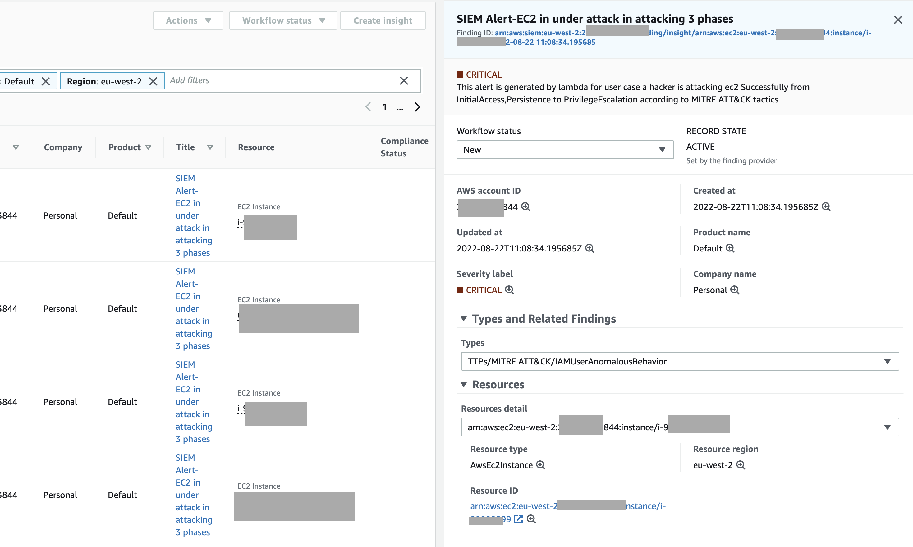

# Securityhub Simple Way to build up your user cases with insights
使用securityhub的insight,对威胁特定的场景,自动生成一条Critical告警.
## Prerequisites
Enable SecurityHub with Other ESS service,set aggregated region for securityhub
Please see详见: https://github.com/jessicawyc/aws-enable-ess
## 架构 Architecture
SecurityHub可以通过两种方式成为SIEM,左侧第一种请详见Global Security Blog本文提供右侧方式的多个场景.

There are two ways to correlate finding in securityhub as below, the left side using dynamoDB, you may refer this [offical blog](https://aws.amazon.com/cn/blogs/security/correlate-security-findings-with-aws-security-hub-and-amazon-eventbridge/). 
In this article, I will show you the architecure in the right side,by using insights with lambda.

## 场景 User Cases
## Deployment for User case 1:S3:Public access & Sensitive data
S3:[Public access & Sensitive data](/s3/Readme.md) 部署第一个user case
### Step 1 Design insights
For this user case, we  will use aws managed insights:
  "2. S3 buckets with public write or read permissions"
  "10. S3 buckets with sensitive data"
You may find the arn in the offical document and give the arn to parameter in step 2
https://docs.aws.amazon.com/securityhub/latest/userguide/securityhub-managed-insights.html

### Step 2 Deploy by Cloudformation Template
Use CLI to create a cloudformation stack or you may use console to do this see detail steps in https://docs.aws.amazon.com/AWSCloudFormation/latest/UserGuide/cfn-console-login.html.

参数设置 Set Parameter
```
stackname='securityhub-siem-2'
templatename='Sechub-2insight-template.yaml'
region='us-east-1'
arn1='arn:aws:securityhub:::insight/securityhub/default/10'
arn2='arn:aws:securityhub:::insight/securityhub/default/12'
findingtype='Software and Configuration Checks/Amazon Security Best Practices'
title='SIEM Alert-Publicly shared S3 with sensitive data'
resourcetype='AwsS3Bucket'
```
运行CLI命令 Run CLI command

```
aws cloudformation create-stack --stack-name $stackname --template-body file://$templatename \
--parameters  \
ParameterKey=arn1,ParameterValue=$arn1  \
ParameterKey=arn2,ParameterValue=$arn2  \
ParameterKey=findingtype,ParameterValue=$findingtype  \
ParameterKey=title,ParameterValue=$title  \
ParameterKey=resourcetype,ParameterValue=$resourcetype  \
--capabilities CAPABILITY_IAM \
--region=$region
```
Test result in securityhub


## Deployment for User case 2 :IAM attack in 3 Phases 部署第二个user case
### Step 1 Design insights
For this user case, we  will use 3 custom insights, you may follow the [offical guide](https://docs.aws.amazon.com/securityhub/latest/userguide/securityhub-custom-insights.html#:~:text=include%20both%20resources.-,Creating%20a%20custom%20insight%20(console),-From%20the%20console )to create custom insights in console or use CLI command below.
参数设置 Set Paramter
```
region='eu-west-2'
insight1='usecase2-1-InitialAccess'
insight2='usecase2-2-Persistence'
insight3='usecase2-3-PrivilegeEscalation'
```
运行CLI命令 Run CLI Command

```
arn1=$(aws securityhub create-insight \
--filters \
 '{"RecordState": [{ "Comparison": "EQUALS", "Value": "ACTIVE"}], "WorkflowStatus": [{"Comparison": "EQUALS", "Value": "NEW"}],"ResourceType": [{"Comparison": "EQUALS", "Value": "AwsEc2Instance"}], "Type": [{"Comparison": "PREFIX", "Value": "TTPs/Initial Access"}]}' \
 --group-by-attribute "ResourceId" \
--name $insight1 \
--query 'InsightArn' --output text --region=$region)
echo $arn1
arn2=$(aws securityhub create-insight \
--filters \
 '{"RecordState": [{ "Comparison": "EQUALS", "Value": "ACTIVE"}], "WorkflowStatus": [{"Comparison": "EQUALS", "Value": "NEW"}],"ResourceType": [{"Comparison": "EQUALS", "Value": "AwsEc2Instance"}], "Type": [{"Comparison": "PREFIX", "Value": "TTPs/Persistence"}]}' \
 --group-by-attribute "ResourceId" \
--name $insight2 \
--query 'InsightArn' --output text --region=$region)
echo $arn2
arn3=$(aws securityhub create-insight \
--filters \
 '{"RecordState": [{ "Comparison": "EQUALS", "Value": "ACTIVE"}], "WorkflowStatus": [{"Comparison": "EQUALS", "Value": "NEW"}],"ResourceType": [{"Comparison": "EQUALS", "Value": "AwsEc2Instance"}], "Type": [{"Comparison": "PREFIX", "Value": "TTPs/Privilege Escalation"}]}' \
 --group-by-attribute "ResourceId" \
--name $insight3 \
--query 'InsightArn' --output text --region=$region)
echo $arn3
```
If you check the console, you will see 3 custom insights are created 


### Step 2 Deploy by Cloudformation Template
Use CLI to create a cloudformation stack or you may use console to do this see detail steps in [official document](https://docs.aws.amazon.com/AWSCloudFormation/latest/UserGuide/cfn-console-login.html)

参数设置 Set Paramter
```
stackname='securityhub-siem-3IAM'
templatename='Sechub-3insight-template.yaml'
findingtype='TTPs/MITRE ATT&CK/IAMUserAnomalousBehavior'
title='SIEM Alert-EC2 in under attack in attacking 3 phases'
resourcetype='AwsEc2Instance'

```
运行CLI命令 Run CLI Command

```
aws cloudformation create-stack --stack-name $stackname --template-body file://$templatename \
--parameters  \
ParameterKey=arn1,ParameterValue=$arn1  \
ParameterKey=arn2,ParameterValue=$arn2  \
ParameterKey=arn3,ParameterValue=$arn3  \
ParameterKey=findingtype,ParameterValue=$findingtype  \
ParameterKey=title,ParameterValue=$title  \
ParameterKey=resourcetype,ParameterValue=$resourcetype  \
--capabilities CAPABILITY_IAM \
--region=$region
```
Test result in securityhub

## Deployment for User case 3 :S3 delete & No versioning 部署第三个user case
### Step 1 Design insights
For this user case, we  will use 3 custom insights, you may follow the [offical guide](https://docs.aws.amazon.com/securityhub/latest/userguide/securityhub-custom-insights.html#:~:text=include%20both%20resources.-,Creating%20a%20custom%20insight%20(console),-From%20the%20console )to create custom insights in console or use CLI command below.
### Step 2 Deploy by Cloudformation Template
Test result in securityhub

